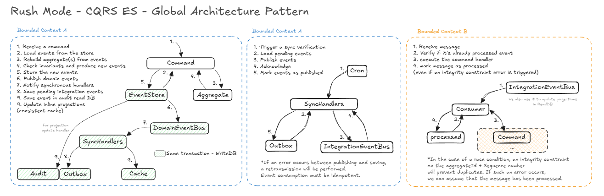

# CQRS Event Sourcing Architecture Documentation

## Table of Contents

- [Global Architecture](#global-architecture)
- [Introduction](#introduction)
- [Core Concepts](#core-concepts)
- [Why CQRS + Event Sourcing?](#why-cqrs--event-sourcing)
  - [Asynchronous, Distributed Workflow](#asynchronous-distributed-workflow)
  - [Strong Auditability Requirements](#strong-auditability-requirements)
  - [Divergent Read and Write Models](#divergent-read-and-write-models)
  - [Distributed Integration](#distributed-integration)
- [Key Architectural Concepts](#key-architectural-concepts)
  - [Domain-Driven Design (DDD)](#domain-driven-design-ddd)
  - [CQRS](#cqrs)
  - [Event Sourcing](#event-sourcing)
  - [Inline Projections](#inline-projections)
  - [Outbox Pattern & Integration Events](#outbox-pattern--integration-events)
- [Conclusion](#conclusion)

---

## Global Architecture

Below is the high-level pattern architecture diagram applied in the project:

---

## Introduction

This documentation outlines the architectural approach of using **Domain-Driven Design (DDD)**, **Command Query Responsibility Segregation (CQRS)**, and **Event Sourcing (ES)**. This approach is suitable for automating complex workflows, leveraging:

- **Domain-Driven Design (DDD)**
- **CQRS and ES** for maintaining consistency and auditability
- **asynchronous projections** for read models
- **Outbox pattern** for reliable integration event delivery
- A monolithic, but ready for be distributed, architecture for real-time updates and notifications

---

## Core Concepts

The architecture models key behaviors and constraints of complex systems, such as:

- Tracking of player progression
- Tracking of player achievements
- Tracking of player fraud suspicion

These processes are ideally suited for an **event-driven** architecture, where Event Sourcing ensures accurate state and history management.

---

## Why CQRS + Event Sourcing?

### Asynchronous, Distributed Workflow

Updates occur asynchronously, and various components react to these domain events. A reactive architecture naturally supports this distributed event-driven flow.

---

### Strong Auditability Requirements

Complete histories of events are required to track:

- Achievements
- player activities
- rush evolution over time

Event Sourcing provides an **immutable, chronological timeline** of all past events.

---

### Divergent Read and Write Models

The **write model** enforces strict domain rules and invariants, while the **read model** optimizes:

- User dashboards
- Real-time notifications
- Visualizations and tracking interfaces

CQRS allows these models to develop independently, each tailored to its specific tasks.

---

### Distributed Integration

The system must integrate seamlessly with various APIs, services, and contexts. Utilizing an Outbox + IntegrationEventBus ensures:

- Reliable message delivery
- Retries and retransmission
- Idempotent consumer processing

---

## Key Architectural Concepts

### Domain-Driven Design (DDD)

**Aggregates**  
Define boundaries and safeguard invariants.

**Entities / Value Objects**  
Represent key domain concepts.

**Domain Events**  
Capture significant occurrences within the domain.

**Bounded Contexts**  
Segment the domain into logically cohesive subdomains.

---

### CQRS

Commands are used for state mutation, and queries for state reading. This separation allows for optimized read models powered by projections while write operations remain focused on event-sourcing and invariants.

---

### Event Sourcing

State reconstruction follows a series of steps:

1. Load past events
2. Rebuild aggregates
3. Execute command logic
4. Generate new events

Benefits include:

- Full audit trail
- Precise state recomputation
- Simplified debugging
- Temporal querying capabilities

---

### Inline Projections (Audit log)

Projections updated **synchronously** with event store transactions maintain a snapshot cache. This enables fast state diff calculations and enforces strong consistency for immediate read operations.

---

### Outbox Pattern & Integration Events

Transactions on the write-side may produce integration events saved in an Outbox. A scheduler then publishes them to the IntegrationEventBus.

Advantages:

- Prevents message loss
- Guarantees no duplicates
- Consumers are fully idempotent
- Supports asynchronous projections

---

### Processed Events & Thundering Update Prevention

The system tracks each integration event's unique ID to maintain idempotency and ensure no double applications. Read models, being **pull-based**, are updated reactively, which avoids unnecessary duplicate state rebuilds.

## Conclusion

The use of **DDD + CQRS + Event Sourcing** provides a scalable, traceable, and consistent architecture. It models complex systems effectively, offering full transparency and alignment with event-driven domain requirements.

Future sections will explore specific applications of this model, including aggregates, event stores, projections, and integration strategies.
